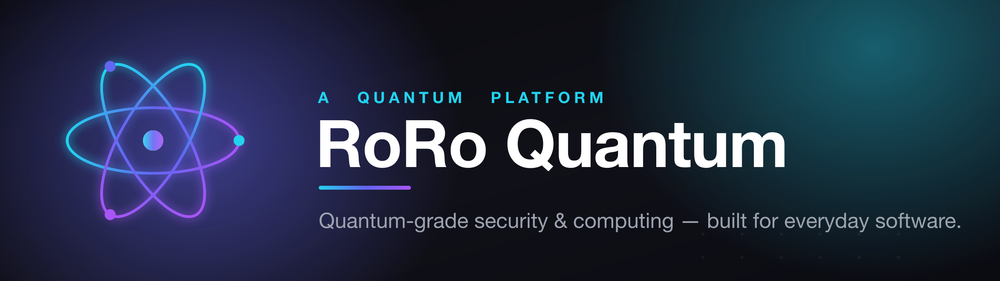

 
 

&nbsp;

 

**Quantum-grade security & computing, built for everyday software.**

We craft the cryptographic foundations and developer tooling that make
quantum-era security practical — secure by default, simple to adopt,
and ready for production.

 

## 🌐 Products

|  |  |
|:--|:--|
| **⚛️&nbsp; RoRo Quantum** | Our quantum platform — the home of everything we build. &nbsp; → [roroquantum.com](https://roroquantum.com) |
| **🔐&nbsp; Qsaferoom** | A quantum-safe secure room for protecting what matters. &nbsp; → [qsaferoom.com](https://qsaferoom.com) |

## 📦 Open Source

Our SDKs and libraries will live here in the open — _repositories are on the way._

When they land, expect them to be:

- 🛡️ **Secure by default** — the safe path is the easy path.
- 📖 **Well documented** — a great README and a 5-minute quick start.
- 🚀 **Production-grade** — typed, tested, and versioned.

## 🧭 How We Work

- **Security first** — we don't trade safety for convenience.
- **Clarity over cleverness** — readable code and honest docs win.
- **Small, sharp, shipped** — focused tools that do one thing well.
- **Open by intent** — what can be public, becomes public.

## 🤝 Contributing

We welcome contributions. Start with our
**[Contributing Guide](https://github.com/RoRo-Quantum/.github/blob/main/CONTRIBUTING.md)**
and **[Code of Conduct](https://github.com/RoRo-Quantum/.github/blob/main/CODE_OF_CONDUCT.md)**.
Found a security issue? Please follow our
**[Security Policy](https://github.com/RoRo-Quantum/.github/blob/main/SECURITY.md)**.

 

⚛️ Built with rigor by the RoRo Quantum team · <a href="https://roroquantum.com">roroquantum.com</a>

